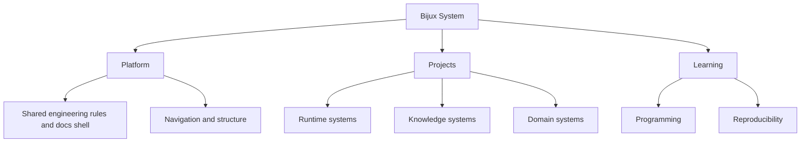

# System Map

<strong>Use this page when</strong> you want a fast orientation to how Platform, Projects, and Learning fit together before opening individual repositories.

The Bijux public surface is easier to understand as a layered system
than as a list of repositories. The map helps because it shows where
responsibility changes hands and where different kinds of engineering
judgment are expected.
This map is meant to make system responsibility legible before
implementation detail.

In plain terms: Platform defines the shared structure and rules, Projects
apply that structure in runtime/knowledge/domain repositories, and
Learning explains the same engineering methods through teachable
programs. Together, these layers keep responsibilities clear while still
forming one public system.

## Layered View

## What Each Layer Owns

### Conceptual Layers

| Layer | What it owns | Why it stays separate |
| --- | --- | --- |
| Platform | shared engineering rules, documentation shell, release discipline, and boundary vocabulary | keeps cross-repository behavior stable and inspectable |
| Projects | runtime systems, knowledge systems, delivery interfaces, and domain products | keeps implementation ownership explicit and reviewable by repository |
| Learning | course books, deep dives, capstones, and reusable technical explanation | keeps teaching and explanation rigorous without replacing repository ownership |

### Repository Family Roles

| Repository role | Primary ownership |
| --- | --- |
| Core | runtime authority and governance behavior |
| Canon | knowledge-system orchestration and reasoning boundaries |
| Atlas | delivery interfaces, service outputs, and reporting routes |
| Proteomics and Pollenomics | domain-specific workflows and evidence-heavy product outputs |
| Masterclass | learning programs and executable instructional artifacts |

## Why The Split Holds Up

This page does not need to claim sophistication directly. That quality
becomes visible when the split remains coherent across runtime,
delivery, domain, and learning surfaces without collapsing into one
vague repository or one oversized story. The map holds up when each
layer has a stable job and the boundaries still make sense after
readers open the repository pages.

## Why The Split Matters

- easier review because each layer has a clear job and inspection route
- easier evolution because changes stay local to the owning layer
- less accidental coupling between runtime, delivery, and domain concerns
- clearer operational truth when responsibilities are explicit in public

## Boundary Questions To Ask

- does each repository own a distinct problem instead of a renamed slice of the same problem
- does the delivery surface stay separate from the runtime and knowledge internals
- do the domain systems inherit the platform posture without being forced into generic abstractions
- can a reader move across layers and still keep a consistent mental model

## Where Responsibility Changes Hands

- Platform -> Core: shared boundary and release rules become executable runtime and governance behavior.
- Core/Canon -> Atlas: internal runtime and knowledge capabilities become public delivery interfaces and reporting routes.
- Platform/Projects -> Domain products: shared engineering rules are applied to specialized scientific workflows and evidence outputs.
- Projects -> Learning: repository practices are translated into course books and capstones without changing source ownership.

The system map exists to make the landscape legible before readers dive
into local detail. It shows how platform guides, project repositories,
and learning surfaces belong to one designed system where relationships
are explicit, responsibilities are visible, and complexity is managed
through structure rather than implication.
