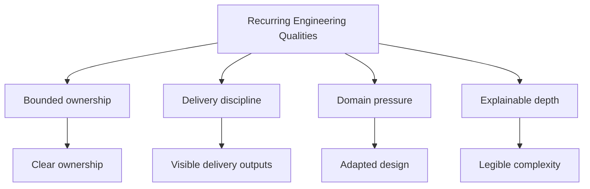

# Recurring Engineering Qualities

This page is the shortest route into the recurring qualities of the
Bijux repositories and where those qualities become visible publicly.

<strong>The useful question is how the work is organized when it becomes public.</strong>
Across the repositories, the same patterns recur: bounded ownership,
delivery discipline, domain pressure handling, and explainable depth.

## Qualities Map

## Canonical Qualities

| Quality | Verification question | Evidence anchors |
| --- | --- | --- |
| Bounded ownership | Are responsibilities split cleanly so repository boundaries stay non-overlapping under change? | [System map](system-map.md), [Repository matrix](repository-matrix.md), [Bijux Core](../projects/bijux-core.md), [Bijux Canon](../projects/bijux-canon.md) |
| Delivery discipline | Are documentation, release behavior, and publication routes visible as maintained engineering surfaces? | [Delivery surfaces](delivery-surfaces.md), [Public surface](public-surface.md), [Bijux Atlas](../projects/bijux-atlas.md) |
| Domain pressure handling | Does the structure stay coherent when scientific workflows and evidence-heavy interpretation are required? | [Applied domains](applied-domains.md), [Bijux Proteomics](../projects/bijux-proteomics.md), [Bijux Pollenomics](../projects/bijux-pollenomics.md) |
| Explainable depth | Can architecture and workflow decisions be taught with runnable materials instead of only summaries? | [Learning catalog](../learning/index.md), [Reproducible Research](../learning/reproducible-research.md), [Python Programming](../learning/python-programming.md) |

## Failure Signals When A Quality Is Missing

| Quality | Failure signal |
| --- | --- |
| Boundary judgment | one repository absorbs unrelated concerns and interface intent becomes unclear |
| Delivery ownership | docs and release behavior drift away from repository reality |
| Data and service architecture | runtime, delivery, and policy responsibilities become entangled |
| Domain adaptation | domain-specific work relies on one-off scripts and weak contracts |
| Technical communication | explanation becomes abstract and cannot be traced back to working systems |

## Why These Qualities Recur

  
<h3>Bounded Systems</h3>
Clear repository boundaries are costly to maintain unless they reflect real ownership. They are one of the fastest ways to distinguish systems thinking from namespace inflation.

  
<h3>Inspectable Delivery</h3>
A strong public surface routes into maintained documentation, published endpoints, automation, and operating rules. Delivery should be visible before anyone asks for private context.

  
<h3>Domain Pressure</h3>
Infrastructure alone is not enough. Technical judgment is easier to inspect when it survives proteomics, pollenomics, evidence mapping, and scientific workflow constraints.

  
<h3>Explainable Depth</h3>
Engineers who can teach architecture, workflow discipline, and programming design usually understand the systems well enough to build and evolve them cleanly.

## Short Reading Routes

| If you want to start with... | Read this route |
| --- | --- |
| platform and software architecture | [System map](system-map.md) -> [Bijux Core](../projects/bijux-core.md) -> [Bijux Canon](../projects/bijux-canon.md) |
| delivery posture and public surfaces | [Delivery surfaces](delivery-surfaces.md) -> [Bijux Atlas](../projects/bijux-atlas.md) -> [Public surface](public-surface.md) |
| data-service and knowledge-system design | [Platform overview](index.md) -> [Bijux Atlas](../projects/bijux-atlas.md) -> [Bijux Canon](../projects/bijux-canon.md) |
| bioinformatics and domain-heavy engineering | [Applied domains](applied-domains.md) -> [Bijux Proteomics](../projects/bijux-proteomics.md) -> [Bijux Pollenomics](../projects/bijux-pollenomics.md) |
| technical clarity and education | [Learning catalog](../learning/index.md) -> [Reproducible Research](../learning/reproducible-research.md) -> [Python Programming](../learning/python-programming.md) |

## Reading Rule

This page works best as a routing layer for inspection rather than a
standalone conclusion. The repositories and published documentation
carry the depth.

These qualities are intended to function as engineering standards rather
than style preferences. Bounded ownership, delivery discipline, domain
pressure handling, and explainable depth define the conditions under
which software becomes easier to trust, review, and evolve across the
full repository family.
