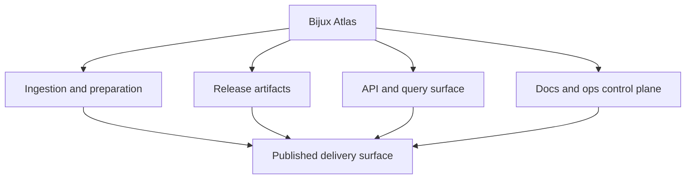

# Bijux Atlas

Atlas is the Bijux delivery surface for immutable datasets, APIs,
service contracts, and operated documentation.

`bijux-atlas` is the delivery and operational surface for services,
datasets, APIs, and docs control-plane behavior. It is a direct route in
the site for data delivery, service architecture, and operational
visibility.
It exists to keep queryable delivery, immutable artifacts, service
contracts, and publication surfaces visible as first-class engineering
boundaries.

Concrete Atlas surfaces include:

- CLI
- API
- OpenAPI export
- docs
- release artifacts
- control plane

<a class="md-button md-button--primary" href="https://bijux.io/bijux-atlas/">View Published Docs</a>
<a class="md-button" href="https://github.com/bijux/bijux-atlas">View GitHub Repository</a>

## Repository Shape

`bijux-atlas` presents data-service work as an operated product surface
rather than a loose data tool. The repository
publishes a CLI, server, OpenAPI export surface, and maintainer control
plane around governed genomics dataset delivery and immutable query
artifacts.

## System Map

## What This Repository Demonstrates Architecturally

- immutable artifact posture for dataset and query outputs under change
- queryable delivery interfaces with explicit API and contract surfaces
- control-plane separation between runtime serving and maintainer operations
- publication boundaries where docs, release behavior, and contracts remain aligned

## What Lives Here

- API and dataset delivery treated as first-class product interfaces
- immutable artifact thinking instead of ad hoc mutable dataset handling
- docs-aware validation, operational reporting, and control-plane behavior as part of delivery
- explicit runtime surfaces: CLI, server, OpenAPI export, and maintainer tooling

## Where To Begin

| If you are looking for... | Start with this part of Atlas |
| --- | --- |
| service architecture | the split between CLI, server, OpenAPI export, and maintainer control plane |
| data delivery posture | immutable dataset and artifact language in the docs and README |
| operational seriousness | ops, configs, reporting, and documentation validation behavior |
| published entry points | the handbook structure and published docs site that route into concrete service surfaces |

## Why This Matters Operationally

- service consumers can inspect stable contracts before integration work starts
- dataset publication and delivery behavior are governed instead of ad hoc
- maintenance workflows remain explicit, reducing hidden operational risk
- documentation and implementation move together, improving trust in public surfaces

## When This Page Is Most Useful

- the question is about API delivery, dataset publishing, or service behavior
- you are tracing docs UX checks, ops validation, or operational evidence
- you want a concrete public route into data-service engineering

## In The Larger Picture

Atlas keeps delivery work out in the open as something that is
published, validated, and operated rather than described abstractly.

Bijux Atlas should be read as a delivery-facing system where contracts,
artifacts, and public access must align cleanly enough to stay
inspectable and useful over time. Within the broader family, it shows
that publication and data delivery are architectural concerns, requiring
the same boundary discipline and operational rigor as any core runtime
surface.
