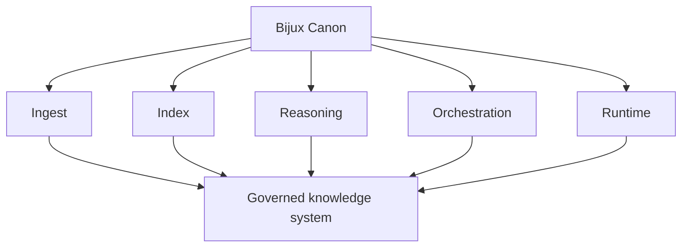

# Bijux Canon

`bijux-canon` is the governed knowledge-system stack for deterministic
ingest, retrieval, reasoning, orchestration, and controlled runtime
acceptance. It is a clear route into system decomposition around AI and
knowledge workflows.
In plain language, Canon is where knowledge-system work is turned into a
maintained engineering stack instead of a single opaque AI layer.

<a class="md-button md-button--primary" href="https://bijux.io/bijux-canon/">Open published docs</a>
<a class="md-button" href="https://github.com/bijux/bijux-canon">Open GitHub repository</a>

## Repository Shape

`bijux-canon` avoids collapsing ingest, indexing, reasoning,
orchestration, and policy into one blurred "AI platform" layer. The
repository makes those concerns explicit through packages, contracts,
compatibility surfaces, and runtime boundaries that readers can inspect
directly.
This map shows the package layers as one governed knowledge system.

Each layer stays explicit so inputs, reasoning, and runtime behavior can
be reviewed as connected but distinct responsibilities.

## Why The Package Split Is Intentional

- ingest, indexing, reasoning, orchestration, and runtime acceptance change at different speeds
- compatibility work is visible as its own surface instead of hidden migration breakage
- each package boundary creates a reviewable interface rather than a private internal convention
- growth in one area does not force unrelated redesign in the rest of the system

## What Lives Here

- a contract-first package family instead of one all-purpose AI library
- explicit separation between ingest, index, reason, agent, and runtime responsibilities
- compatibility handled openly through dedicated package surfaces rather than hidden breaking changes
- release and documentation discipline aligned with the repository layout

## Open Here First

| If you are looking for... | Open this part of Canon |
| --- | --- |
| knowledge-system boundaries | the package map across runtime, ingest, index, reason, and agent surfaces |
| contract discipline | checked-in schemas, package-specific docs, and the repository-owned documentation structure |
| compatibility judgment | the compat packages and consolidation material that keep older names explicit |
| governed execution | runtime and replay language that makes control and verification part of the system model |

## One Path Through The Stack

1. begin with ingest and indexing contracts to see how system inputs are normalized
2. continue through reasoning and orchestration packages to follow explicit decision flow
3. finish with controlled runtime acceptance and replay surfaces to inspect verification behavior

## Best Entry Questions

- the question is about ingest, indexing, reasoning, agents, or runtime control
- you want to see how a knowledge system is split into accountable components
- you care whether AI-oriented architecture stays inspectable as the package family grows

## In The Larger Picture

Canon keeps AI and knowledge workflows split into maintained parts
instead of collapsing them into one vague layer. The package boundaries
stay visible all the way out to the public docs.

Bijux Canon is organized around the idea that knowledge systems stay
durable only when ingest, indexing, reasoning, orchestration, and
runtime responsibilities are separated with intention. Its value is not
the package count alone, but the layered governance model that keeps the
system extensible, inspectable, and coherent as it evolves.
