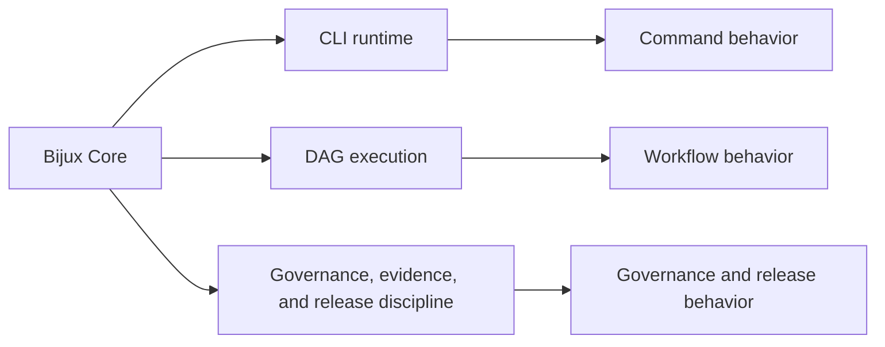

# Bijux Core

`bijux-core` is the execution and governance backbone for the public
Bijux system family. It is the primary starting point when the question is
about runtime authority, repository discipline, or the engineering
systems that should remain stable beneath dependent repositories.

Core contains four concrete surfaces: CLI runtime, DAG execution
substrate, governance and control-plane routes, and evidence/release
rules.

<a class="md-button md-button--primary" href="https://bijux.io/bijux-core/">View Published Docs</a>
<a class="md-button" href="https://github.com/bijux/bijux-core">View GitHub Repository</a>

## Repository Shape

`bijux-core` is where runtime and governance stop being abstract. The
repository owns the command runtime and DAG execution backbone that
dependent systems depend on, while keeping governance, evidence, and
release discipline visible in the same public surface.
This map summarizes the authority split that keeps Core legible.

The split keeps command semantics, workflow semantics, and repository
governance explicit instead of blending them into one opaque layer.

## Runtime Authority Vs Governance Authority

Runtime authority defines how commands and workflows execute: what can
run, in what order, and with which execution semantics. Governance
authority defines how those runtime surfaces are controlled over time:
release rules, evidence expectations, and repository-level policy
boundaries. Keeping them distinct prevents execution behavior from being
silently changed by policy concerns, and prevents policy controls from
being hidden inside runtime code paths.

## What This Repository Makes Visible

- runtime truth: command behavior and execution authority are explicit, not implied
- deterministic execution: DAG behavior is modeled as a stable contract surface
- control-plane separation: governance and release rules are maintained without blurring runtime logic
- documentation as ownership map: repository docs mirror the actual operational split

## What Lives Here

- two distinct products with shared governance: `bijux-cli` and `bijux-dag`
- command and runtime thinking that is explicit rather than hidden in scripts
- evidence, release, and repository control surfaces treated as first-class concerns
- crate and package boundaries that keep execution, artifacts, and governance legible

## Where To Begin

| If you are looking for... | Start with this part of Core |
| --- | --- |
| runtime authority | the CLI and DAG handbooks, plus the crate split across runtime, artifacts, and app layers |
| repository discipline | release flows, evidence surfaces, and maintainer control-plane material |
| product boundaries | the fact that `bijux-cli` and `bijux-dag` are separate products under one governance backbone |
| traceability | public docs, tagged releases, and repository-owned operating rules that align with the code layout |

## When This Page Is Most Useful

- the question is about CLI behavior, DAG execution, runtime control, or release discipline
- you want a direct route into platform engineering structure
- you care whether governance and release posture are visible instead of implied

## In The Larger Picture

Core keeps the rest of the repository family grounded in visible runtime
and governance machinery. The backbone is named, inspectable, and
stable enough to support the higher layers around it.

Bijux Core represents the layer where runtime truth, deterministic
execution, and repository control must remain least ambiguous. Beyond
the tools themselves, it keeps authority boundaries and workflow
semantics explicit so core behavior stays understandable under
long-term change.
