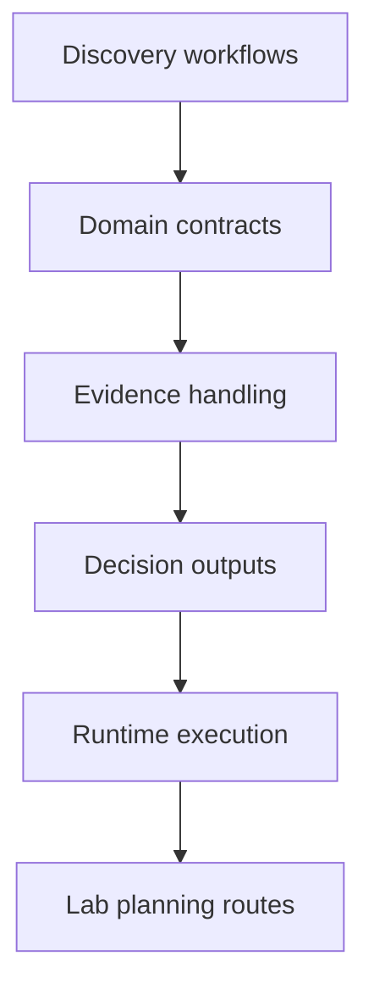

# Bijux Proteomics

`bijux-proteomics` is the proteomics and discovery product surface in
the Bijux repository family. It shows how the same platform and software
discipline carries into scientific and laboratory-adjacent work.
In plain language, this repository helps teams and scientists move from
discovery workflows to governed software surfaces with clear contracts,
runtime behavior, and evidence paths.

For scientists and teams, this means turning experiment-driven work into
repeatable software routes: run discovery workflows, track evidence,
produce decision-ready outputs, and keep lab-facing planning steps
traceable over time.

<a class="md-button md-button--primary" href="https://bijux.io/bijux-proteomics/">View Published Docs</a>
<a class="md-button" href="https://github.com/bijux/bijux-proteomics">View GitHub Repository</a>

## Repository Shape

`bijux-proteomics` treats protein discovery as a governed software
system rather than a single pipeline. Runtime execution, domain
contracts, decision intelligence, evidence governance, and lab planning
are kept as explicit package boundaries.
Decision intelligence is exposed through the repository's intelligence
surfaces, while lab planning is exposed through lab-oriented package
surfaces and documented workflow routes.
This map summarizes the core technical surfaces in the repository.

It reflects the repository's design choice to keep scientific workflow
concerns explicit rather than hidden in ad hoc glue.

## How This Work Differs From Generic Application Code

- domain contracts need to remain correct while scientific assumptions evolve
- evidence handling and lab planning are treated as core outputs rather than optional side results
- runtime behavior supports reproducibility and review, not only convenience
- package boundaries stay coherent under both engineering and domain pressure

## What This Repository Demonstrates Architecturally

- evidence governance as a maintained system concern
- runtime design that stays explicit across domain workflows
- package boundaries that preserve responsibility and reviewability
- domain contracts that can be inspected and evolved without hidden coupling

## What Lives Here

- a contract-first package family for scientific product work
- domain models, decision logic, evidence handling, and lab planning kept separate
- reproducibility and reviewability treated as part of the product, not a later cleanup step
- public scientific software that still looks engineered rather than improvised

## Where To Begin

| If you are looking for... | Start with this part of Proteomics |
| --- | --- |
| domain decomposition | the split across runtime, foundation, core, intelligence, knowledge, and lab packages |
| governed product behavior | the repository’s emphasis on contracts, release discipline, and package-owned responsibilities |
| scientific workflow maturity | the fact that lab planning and evidence resolution are explicit parts of the system model |
| published entry points | the package handbooks and release surfaces for the six published packages |

## When This Page Is Most Useful

- the work is specifically about proteomics, discovery, or lab-facing workflows
- you want to see how engineering structure adapts to scientific product work
- you care whether domain software is treated with the same rigor as platform software

## In The Larger Picture

Proteomics keeps software structure visible while moving into domain
systems where data, workflow, and subject-matter context all matter at
the same time.

Bijux Proteomics demonstrates how demanding scientific work benefits
from explicit runtime logic, domain contracts, evidence governance, and
decision-support structure instead of loosely connected tooling. It is a
domain repository, but also a proof surface for applying rigorous
engineering where correctness, interpretability, and long-lived clarity
must coexist.
