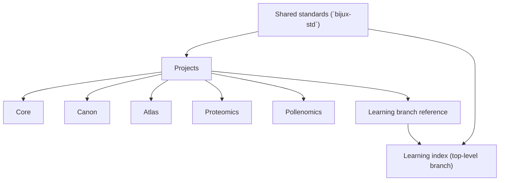

# Projects

This is the fastest way to understand what each public Bijux repository
is for.

This section offers a concentrated cross-section of the work itself.
Each repository below reveals a different part of the same system
family through a different responsibility.
This map provides a quick structural view before diving into individual
project pages.
Projects remain separate in ownership but aligned through shared
standards in `bijux-std`.

It can serve as orientation before moving to the project pages for
repository-specific detail and inspection routes.

## Capability Clusters

| Capability cluster | Repositories |
| --- | --- |
| runtime authority and execution governance | [Bijux Core](bijux-core.md) |
| knowledge-system orchestration and reasoning boundaries | [Bijux Canon](bijux-canon.md) |
| public delivery interfaces and service publication | [Bijux Atlas](bijux-atlas.md) |
| proteomics scientific product workflows | [Bijux Proteomics](bijux-proteomics.md) |
| evidence-mapping product workflows | [Bijux Pollenomics](bijux-pollenomics.md) |
| learning branch route (top-level, not a project repository) | [Learning catalog](../learning/index.md) |

  <article class="bijux-showcase-card">
    
runtime and governance backbone

    <h2>Bijux Core</h2>
    
What it is: the runtime authority repository for CLI and DAG execution.

    
Why it exists: to keep execution behavior and governance boundaries explicit.

    
Where to inspect first: [Bijux Core project page](bijux-core/).

    

      cli
      runtime
      governance
    

    
<a href="bijux-core/">Read the project page</a>

  </article>
  <article class="bijux-showcase-card">
    
governed knowledge system

    <h2>Bijux Canon</h2>
    
What it is: the knowledge-system orchestration repository.

    
Why it exists: to separate ingest, indexing, reasoning, orchestration, and runtime control into accountable interfaces.

    
Where to inspect first: [Bijux Canon project page](bijux-canon/).

    

      ingest
      reasoning
      agents
    

    
<a href="bijux-canon/">Read the project page</a>

  </article>
  <article class="bijux-showcase-card">
    
data and service delivery

    <h2>Bijux Atlas</h2>
    
What it is: the public delivery-interface repository for APIs, datasets, and publication routes.

    
Why it exists: to keep service delivery behavior inspectable and operated as a product surface.

    
Where to inspect first: [Bijux Atlas project page](bijux-atlas/).

    

      api
      datasets
      operations
    

    
<a href="bijux-atlas/">Read the project page</a>

  </article>
  <article class="bijux-showcase-card">
    
applied scientific products

    <h2>Bijux Proteomics</h2>
    
What it is: the proteomics scientific product repository.

    
Why it exists: to apply platform discipline to evidence-heavy discovery workflows.

    
Where to inspect first: [Bijux Proteomics project page](bijux-proteomics/).

    

      proteomics
      product
      scientific software
    

    
<a href="bijux-proteomics/">Read the project page</a>

  </article>
  <article class="bijux-showcase-card">
    
evidence and site selection

    <h2>Bijux Pollenomics</h2>
    
What it is: the evidence-mapping scientific product repository.

    
Why it exists: to keep archaeology/eDNA/aDNA interpretation outputs traceable and reproducible.

    
Where to inspect first: [Bijux Pollenomics project page](bijux-pollenomics/).

    

      pollenomics
      evidence mapping
      archaeology
    

    
<a href="bijux-pollenomics/">Read the project page</a>

  </article>

## What Each Repository Demonstrates

| Repository | What it demonstrates |
| --- | --- |
| [Bijux Core](bijux-core.md) | runtime truth, deterministic execution, and control-plane separation in a stable backbone |
| [Bijux Canon](bijux-canon.md) | governed knowledge-system decomposition with explicit package contracts and compatibility surfaces |
| [Bijux Atlas](bijux-atlas.md) | data-service delivery treated as operated product architecture with immutable artifact posture |
| [Bijux Proteomics](bijux-proteomics.md) | scientific product engineering with explicit evidence governance and domain contracts |
| [Bijux Pollenomics](bijux-pollenomics.md) | uncommon domain adaptation that keeps reproducibility and engineering structure visible |

## What This Page Makes Clear

- this is a coherent set of repository ownership boundaries, not disconnected projects
- each repository is responsible for a distinct layer in the broader architecture
- architecture, delivery, domain pressure, and learning surfaces are inspectable in public

## Reading Guide

| If you care most about... | Start here |
| --- | --- |
| platform and runtime engineering | [Bijux Core](bijux-core.md) |
| governed AI and knowledge systems | [Bijux Canon](bijux-canon.md) |
| data delivery and service architecture | [Bijux Atlas](bijux-atlas.md) |
| bioinformatics and scientific product work | [Bijux Proteomics](bijux-proteomics.md) |
| evidence mapping and field-oriented domain systems | [Bijux Pollenomics](bijux-pollenomics.md) |
| teaching and engineering communication | [Learning catalog](../learning/index.md) |

## Reading Rule

The cards provide orientation, and the project pages offer a closer view
of what each repository owns.

The projects branch is meant to be read as a coherent family of systems
rather than disconnected experiments. Each repository owns a distinct
slice of runtime, delivery, domain, or learning responsibility, and
together they show a consistent pattern of boundary design, explanation,
and system-level engineering judgment.
