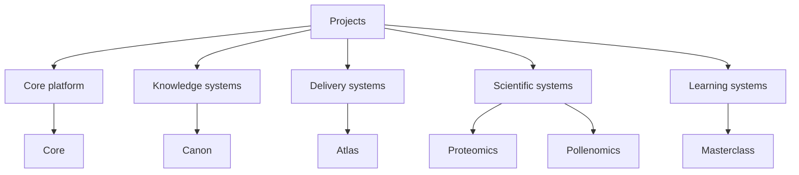

# Projects

Use this section when you want a concentrated cross-section of the work
itself. Each repository below reveals a different part of the same
system family through a different responsibility.
This map provides a quick structural view before diving into individual
project pages.

Use it as orientation, then switch to the project pages for repository
specific detail and inspection routes.

## Capability Clusters

| Capability cluster | Repositories |
| --- | --- |
| core runtime and platform backbone | [Bijux Core](bijux-core.md) |
| governed knowledge and data-system architecture | [Bijux Canon](bijux-canon.md) |
| delivery and data-service product surfaces | [Bijux Atlas](bijux-atlas.md) |
| scientific systems under domain pressure | [Bijux Proteomics](bijux-proteomics.md), [Bijux Pollenomics](bijux-pollenomics.md) |
| technical education systems | [Learning catalog](../learning/index.md) and published `bijux-masterclass` programs |

  <article class="bijux-showcase-card">
    
runtime and governance backbone

    <h2>Bijux Core</h2>
    
Covers command surfaces, DAG execution, evidence handling, release discipline, and the repository backbone that dependent systems can stand on.

    

      cli
      runtime
      governance
    

    
<a href="bijux-core/">Read the project page</a>

  </article>
  <article class="bijux-showcase-card">
    
governed knowledge system

    <h2>Bijux Canon</h2>
    
Covers how ingest, index, reasoning, orchestration, compatibility, and controlled runtime behavior are split into clear package boundaries.

    

      ingest
      reasoning
      agents
    

    
<a href="bijux-canon/">Read the project page</a>

  </article>
  <article class="bijux-showcase-card">
    
data and service delivery

    <h2>Bijux Atlas</h2>
    
Covers API, dataset, and docs-aware control-plane work, where delivery and operational visibility are treated as product concerns.

    

      api
      datasets
      operations
    

    
<a href="bijux-atlas/">Read the project page</a>

  </article>
  <article class="bijux-showcase-card">
    
applied scientific products

    <h2>Bijux Proteomics</h2>
    
Covers how a disciplined software posture carries into discovery and proteomics-oriented product work.

    

      proteomics
      product
      scientific software
    

    
<a href="bijux-proteomics/">Read the project page</a>

  </article>
  <article class="bijux-showcase-card">
    
evidence and site selection

    <h2>Bijux Pollenomics</h2>
    
Covers evidence mapping, archaeology-facing narratives, and domain-specific reasoning surfaces supported by structured engineering.

    

      pollenomics
      evidence mapping
      archaeology
    

    
<a href="bijux-pollenomics/">Read the project page</a>

  </article>

## What Each Repository Demonstrates

| Repository | What it demonstrates |
| --- | --- |
| [Bijux Core](bijux-core.md) | runtime truth, deterministic execution, and control-plane separation in a stable backbone |
| [Bijux Canon](bijux-canon.md) | governed knowledge-system decomposition with explicit package contracts and compatibility surfaces |
| [Bijux Atlas](bijux-atlas.md) | data-service delivery treated as operated product architecture with immutable artifact posture |
| [Bijux Proteomics](bijux-proteomics.md) | scientific product engineering with explicit evidence governance and domain contracts |
| [Bijux Pollenomics](bijux-pollenomics.md) | uncommon domain adaptation that keeps reproducibility and engineering structure visible |

## What A Reviewer Should Be Able To Conclude

- this is a coherent portfolio of system ownership, not disconnected experiments
- each repository is responsible for a distinct layer in the broader architecture
- architecture, delivery, domain pressure, and technical communication are all inspectable in public

## Reading Guide

| If you care most about... | Start here |
| --- | --- |
| platform and runtime engineering | [Bijux Core](bijux-core.md) |
| governed AI and knowledge systems | [Bijux Canon](bijux-canon.md) |
| data delivery and service architecture | [Bijux Atlas](bijux-atlas.md) |
| bioinformatics and scientific product work | [Bijux Proteomics](bijux-proteomics.md) |
| evidence mapping and field-oriented domain systems | [Bijux Pollenomics](bijux-pollenomics.md) |
| teaching and engineering communication | [Learning catalog](../learning/index.md) |

## Reading Rule

Use the cards for orientation and the project pages for a closer view of
what each repository owns.

The projects branch is meant to be read as a coherent family of systems
rather than disconnected experiments. Each repository owns a distinct
slice of runtime, delivery, domain, or learning responsibility, and
together they show a consistent pattern of boundary design, explanation,
and system-level engineering judgment.
