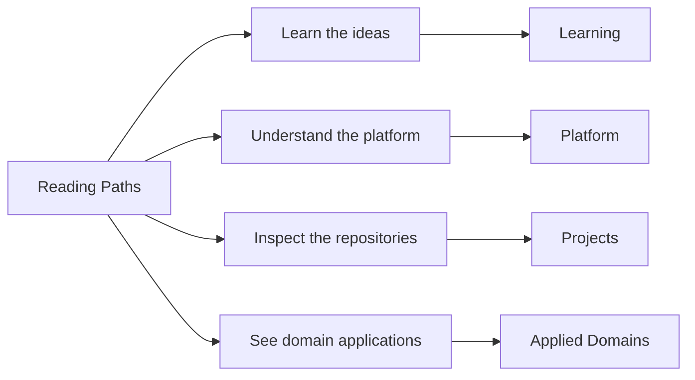

# Reading Paths

This page helps you choose a short path that matches the part of the
work you care about first.
The map below summarizes the main route families at a glance.

If you want a more specific sequence for your time budget, the route
tables below can help.

## The Four Route Families

- Platform: system structure, boundaries, runtime behavior, and delivery logic.
- Projects: repository-level outputs and responsibilities across the family.
- Learning: technical programs that teach through real system artifacts.
- Applied domains: domain pressure in scientific products and evidence-heavy workflows.

## By Reading Intent

| If your goal is... | Read this sequence |
| --- | --- |
| Quick overview | [Home](index.md) -> [Projects](projects/index.md) -> [Work qualities](platform/work-qualities.md) |
| Architecture review | [System map](platform/system-map.md) -> [Repository matrix](platform/repository-matrix.md) -> [Bijux Core](projects/bijux-core.md) -> [Bijux Canon](projects/bijux-canon.md) |
| Delivery review | [Platform](platform/index.md) -> [Delivery surfaces](platform/delivery-surfaces.md) -> [Bijux Atlas](projects/bijux-atlas.md) -> [Public surface](platform/public-surface.md) |
| Domain review | [Applied domains](platform/applied-domains.md) -> [Bijux Proteomics](projects/bijux-proteomics.md) -> [Bijux Pollenomics](projects/bijux-pollenomics.md) -> [Reproducible Research](learning/reproducible-research.md) |
| Learning review | [Learning catalog](learning/index.md) -> [Python Programming](learning/python-programming.md) -> [Reproducible Research](learning/reproducible-research.md) |

## Short Routes

| If you have... | Read this route |
| --- | --- |
| 10 minutes | [Home](index.md) -> [Work qualities](platform/work-qualities.md) -> [Projects](projects/index.md) |
| 20 minutes | [System map](platform/system-map.md) -> [Repository matrix](platform/repository-matrix.md) -> one project page that matches your interest |
| 30 minutes | one platform route, one delivery route, and one domain or learning route to get a broader cross-section |

## Question-Led Routes

| Question | Read this sequence |
| --- | --- |
| How is the system structured? | [Platform](platform/index.md) -> [System map](platform/system-map.md) -> [Repository matrix](platform/repository-matrix.md) -> [Bijux Core](projects/bijux-core.md) |
| How is work delivered? | [Delivery surfaces](platform/delivery-surfaces.md) -> [Public surface](platform/public-surface.md) -> [Bijux Atlas](projects/bijux-atlas.md) -> [Projects](projects/index.md) |
| How does the design survive domain pressure? | [Applied domains](platform/applied-domains.md) -> [Bijux Proteomics](projects/bijux-proteomics.md) -> [Bijux Pollenomics](projects/bijux-pollenomics.md) -> [Reproducible Research](learning/reproducible-research.md) |
| How is teaching integrated? | [Learning catalog](learning/index.md) -> [Python Programming](learning/python-programming.md) -> [Reproducible Research](learning/reproducible-research.md) -> [Projects](projects/index.md) |

## What These Routes Are Designed To Show

- architecture and ownership boundaries that stay coherent under change
- delivery and operational surfaces that can be inspected directly
- domain adaptation without losing engineering rigor
- teaching and explanation quality grounded in real system work

## Reading Approach

- you do not need to read everything
- start with the branch that best matches your interest, then go deeper where the material keeps paying off
- switch branches when you want a broader view of the repository family instead of more depth in one area

The reading paths exist so different readers can inspect the same body
of work from different starting points without losing coherence. That
flexibility matters because strong technical systems should remain
legible to students, specialists, and evaluators alike while preserving
the same architectural signals across routes.
