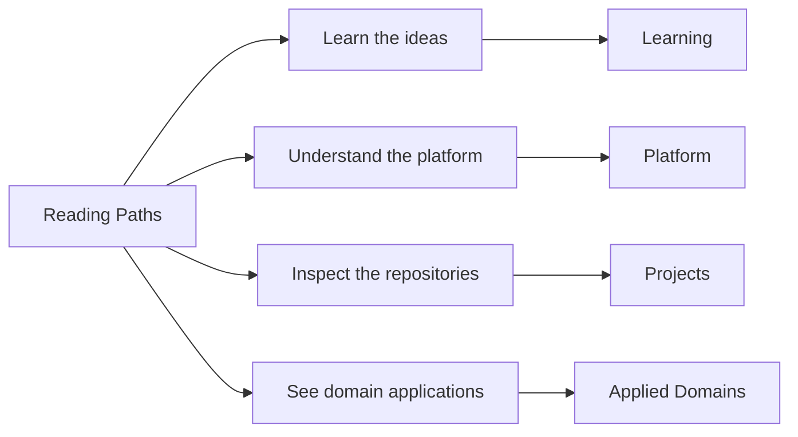

# Reading Paths

This page helps you choose a short path that matches the part of the
work you care about first.

<strong>New here?</strong> Start with
<a href="index.md">Home</a> -> <a href="platform/index.md">Platform</a> ->
<a href="platform/system-map/index.md">System Map</a>. This is the canonical first
route for new readers.

The map below summarizes the main route families at a glance.

Choose a route below by question or by time.

## By Time

| If you have... | Read this route |
| --- | --- |
| 10 minutes | [Home](index.md) -> [Work qualities](platform/work-qualities/index.md) -> [Projects](projects/index.md) |
| 20 minutes | [System map](platform/system-map/index.md) -> [Repository matrix](platform/repository-matrix/index.md) -> one project page that matches your interest |
| 30 minutes | [Platform](platform/index.md) -> [System map](platform/system-map/index.md) -> [Delivery surfaces](platform/delivery-surfaces/index.md) -> [Bijux Atlas](projects/bijux-atlas.md) -> [Applied domains](platform/applied-domains/index.md) |

## By Question

| Question | Read this sequence |
| --- | --- |
| Big picture | [Home](index.md) -> [Platform](platform/index.md) -> [System map](platform/system-map/index.md) |
| System structure | [Platform](platform/index.md) -> [System map](platform/system-map/index.md) -> [Repository matrix](platform/repository-matrix/index.md) |
| Repository roles | [Projects](projects/index.md) -> [Bijux Core](projects/bijux-core.md) -> [Bijux Canon](projects/bijux-canon.md) -> [Bijux Atlas](projects/bijux-atlas.md) |
| Domain work | [Applied domains](platform/applied-domains/index.md) -> [Bijux Proteomics](projects/bijux-proteomics.md) -> [Bijux Pollenomics](projects/bijux-pollenomics.md) |
| Learning | [Learning catalog](learning/index.md) -> [Reproducible Research](learning/reproducible-research.md) -> [Python Programming](learning/python-programming.md) |
| Shared standards and docs shell | [Platform](platform/index.md) -> [Bijux standard layer](platform/bijux-std/index.md) -> [Shell Architecture](platform/shell-architecture/index.md) |
