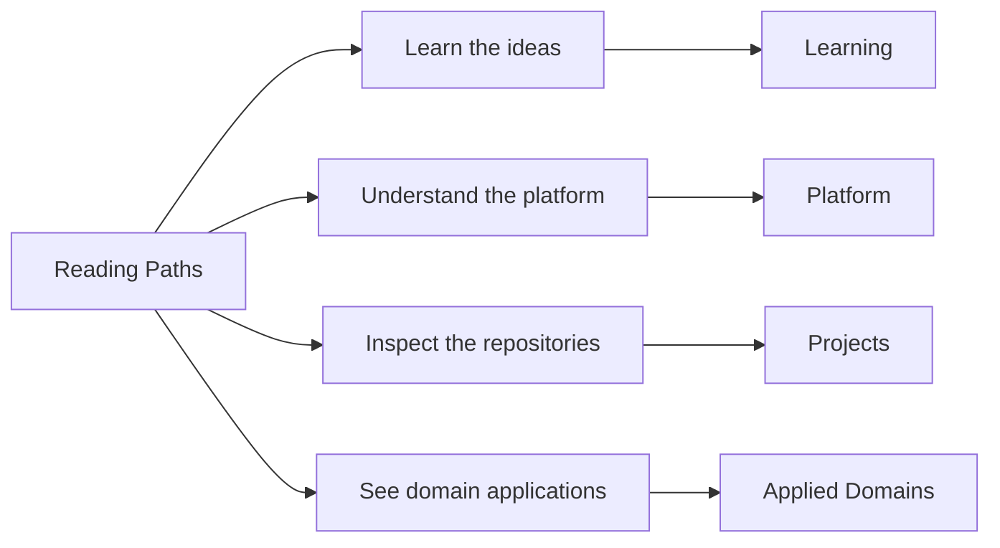

# Reading Paths

This page helps you choose a short path that matches the part of the
work you care about first.

<strong>New here?</strong> Start with
<a href="platform/system-map.md">Platform -> System Map</a> if you care more
about architecture, or start with <a href="projects/index.md">Projects</a> if
you care more about repository outputs.

The map below summarizes the main route families at a glance.

If you want a more specific sequence for your time budget, the route
tables below can help.

## By Time

| If you have... | Read this route |
| --- | --- |
| 10 minutes | [Home](index.md) -> [Work qualities](platform/work-qualities.md) -> [Projects](projects/index.md) |
| 20 minutes | [System map](platform/system-map.md) -> [Repository matrix](platform/repository-matrix.md) -> one project page that matches your interest |
| 30 minutes | [Platform](platform/index.md) -> [System map](platform/system-map.md) -> [Delivery surfaces](platform/delivery-surfaces.md) -> [Bijux Atlas](projects/bijux-atlas.md) -> [Applied domains](platform/applied-domains.md) |

## By Question

| Question | Read this sequence |
| --- | --- |
| How is the system structured? | [Platform](platform/index.md) -> [System map](platform/system-map.md) -> [Repository matrix](platform/repository-matrix.md) -> [Bijux Core](projects/bijux-core.md) |
| How is work delivered? | [Delivery surfaces](platform/delivery-surfaces.md) -> [Public surface](platform/public-surface.md) -> [Bijux Atlas](projects/bijux-atlas.md) -> [Projects](projects/index.md) |
| How does the design survive domain pressure? | [Applied domains](platform/applied-domains.md) -> [Bijux Proteomics](projects/bijux-proteomics.md) -> [Bijux Pollenomics](projects/bijux-pollenomics.md) -> [Reproducible Research](learning/reproducible-research.md) |
| How is teaching integrated? | [Learning catalog](learning/index.md) -> [Python Programming](learning/python-programming.md) -> [Reproducible Research](learning/reproducible-research.md) -> [Projects](projects/index.md) |
